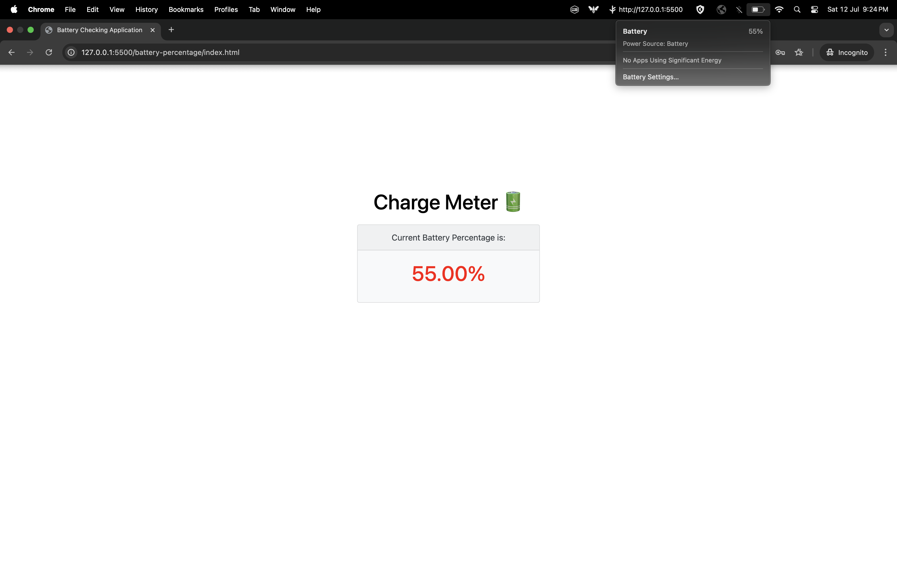

# 🔋 Charge Meter

**Charge Meter** is a simple and lightweight application that displays the **real-time battery charge percentage** of your device. Ideal for monitoring your device's power level, this app ensures you always stay informed about your current battery status.

## 🚀 Features

- 📊 Displays real-time battery percentage
- 🔄 Auto-refresh for updated status
- ✅ Clean and minimal UI
- 💡 Simple to use - just run and view!

## 📸 Charge Meter UI



## 🌐 Live Demo

> 📱 **Note:** This application works on **both desktop and mobile devices** when run **locally**.  
> Use the live link below to **view it on mobile**:

🔗 [**Live View (Mobile Supported)**](https://hema-priya-vadivel.github.io/Charge_Meter/)


## 🚀 How to Run Locally

1. Clone the repository:
   
   ```bash
   git clone https://github.com/hema-priya-vadivel/Charge_Meter.git
